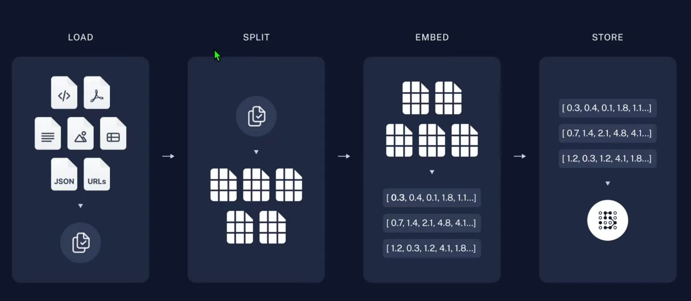
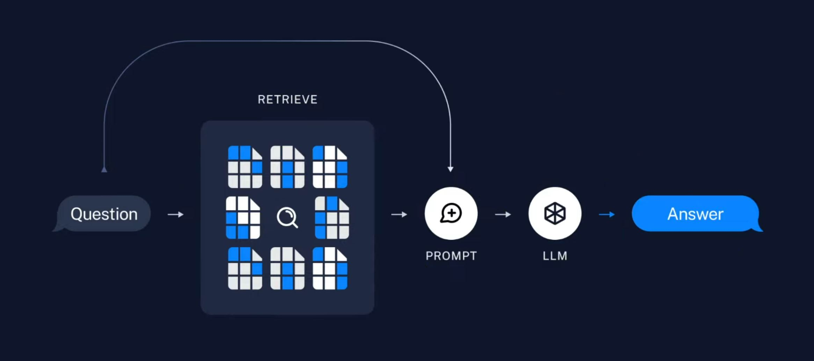

# RAG (Retrieval Augmented Generation)

외부 데이터를 참조해서 LLM이 답변할 수 있도록 해주는 프레임워크

보통 fine-tuning과 함께 설명되며, LLM이 갖고 있지 않은 지식을 포함하기 위한 방법입니다.

다만 fine-tuning은 장비(GPU)를 사용해서 모델을 추가 학습시키는 것이라 일반 사용자가 활용하기는 어렵습니다.

참고 - Fine Tuning: 사전 학습된 인공지능 모델을 특정 작업이나 도메인에 맞게 추가로 학습시키는 과정

# RAG 구조

[RAG 간단히 알아보기](https://youtu.be/kQwxIkspINk?si=hCFgGO9i2zR9UcRJ)

## Retreival 단계 

## Retreiver 단계

