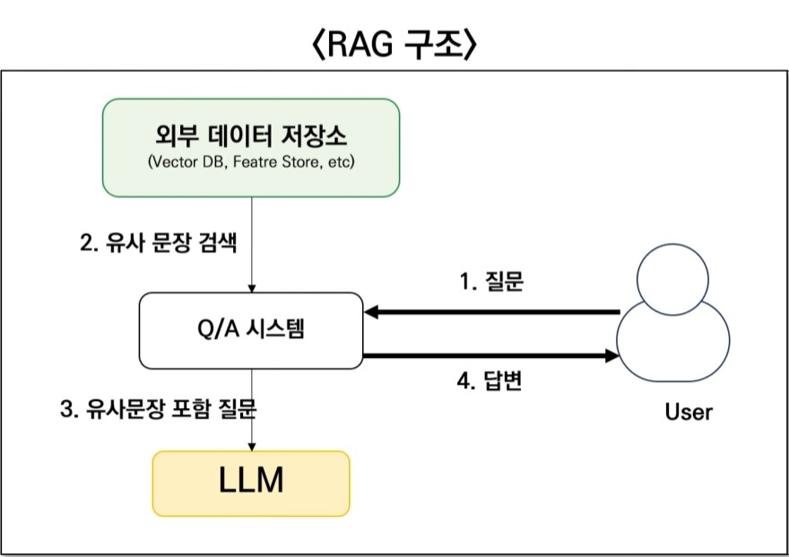

# RAG (Retrieval Augmented Generation)

외부 데이터를 참조해서 LLM이 답변할 수 있도록 해주는 프레임워크

보통 fine-tuning과 함께 설명되며, LLM이 갖고 있지 않은 지식을 포함하기 위한 방법입니다.

다만 fine-tuning은 장비(GPU)를 사용해서 모델을 추가 학습시키는 것이라 일반 사용자가 활용하기는 어렵습니다.

참고 - Fine Tuning: 사전 학습된 인공지능 모델을 특정 작업이나 도메인에 맞게 추가로 학습시키는 과정

## RAG 구조

1. 사용자가 질문을 하면 QA시스템이 외부 데이터저장소에 사용자의 질문과 유사한 문장을 검색합니다.
2. QA시스템은 이렇게 출력된 유사 문장과 사용자의 질문을 합쳐서 LLM에게 프롬프트로 전달합니다.
3. 프롬프트를 전달받은 LLM은 질문에 답변을 합니다.
4. 즉, LLM은 보유하고 있지 않던 데이터를 포함해서 질문에 답할 수 있습니다.

## Retrieval

- LangChain에 Retrieval은 정보를 검색하고 가져오는 전체 과정을 의미합니다.

- 즉, 사용자 쿼리에 대해 관련 정보를 찾아서 반환하는 전반적인 작업을 포함합니다.

- Retrieval은 RAG 시스템의 핵심 단계입니다.

