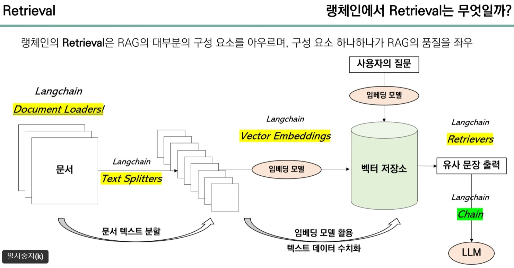

# LangChain에서의 Retrieval

- 원래 Retrieval은 주어진 쿼리에 따라 데이터베이스, 문서, 웹페이지 등 다양한 소스에서 필요한 정보를 찾아내는 과정을 의미합니다.

- LangChain에서 Retrieval은 정보를 검색하고 가져오는 전체 과정을 의미합니다.

- Retrieval은 RAG 시스템의 핵심 단계입니다.



# Retrieval 지원하는 요소들

## Document Loaders

- PDF, 워드, 유튜브 스크립트 등 다양한 문서를 가져올 수 있는 역할을 합니다.

- 불러온 문서는 페이지 콘텐트와 메타 데이터로 구성되는데, 페이지 콘텐트는 문서의 내용을 담당하고, 메타 데이터는 문서의 저장 위치, 제목, 페이지 정보 등을 나타냅니다.

- 메타 데이터는 LLM 답변의 출처를 알려주는 역할을 하며, 이를 통해 어떤 문서를 참조했는지 확인할 수 있습니다.

- 대표적인 종류들: PyPDFLoader, WebBaseLoader 등

```python
# 예 - PDF 로딩

from langchain.document_loaders import PyPDFLoader
from langchain.text_splitter import RecursiveCharacterTextSplitter

# PDF 파일 경로 지정
pdf_path = "/home/user/docs/manual.pdf"

# PyPDFLoader를 사용하여 PDF 파일 로드
loader = PyPDFLoader(pdf_path)

# 로드된 문서를 분할하기 위해 텍스트 분할기 생성
text_splitter = RecursiveCharacterTextSplitter(
    chunk_size=1000,  # 각 조각의 최대 문자 수
    chunk_overlap=200  # 각 조각 사이의 겹치는 문자 수
)

# 로드하고 분할
documents = loader.load_and_split(text_splitter)

# 로드된 문서 확인
for idx, document in enumerate(documents):
    print(f"Document {idx + 1}:")
    print(document)
    print("\n" + "="*80 + "\n")
```

## Text Splitter

Text Splitter는 토큰 제한이 있는 LLM이 여러 문장을 참고해서 답변할 수 있도록 문서를 분할하는 역할을 합니다.

- 글자 수를 기준으로 문서를 분할하는 종류: CharacterTextSplitter, RecursiveCharacterTextSplitter 등

토큰 단위로 텍스트를 분할하면 LLM이 텍스트를 더 잘 처리할 수 있으며, 글자 수로 분할하는 것보다 정확합니다.

- `tiktoken.tokenizer.encode`는 텍스트를 토큰 ID의 리스트로 변환합니다. 텍스트를 모델에 입력하기 위한 토큰 ID 리스트로 변환할 때 사용됩니다.

```python
import tiktoken
from langchain.document_loaders import PyPDFLoader

# PDF 파일 경로 지정
pdf_path = "/home/user/docs/manual.pdf"

# PyPDFLoader를 사용하여 PDF 파일 로드
loader = PyPDFLoader(pdf_path)
documents = loader.load()

# tiktoken 인코더 가져오기
encoding = tiktoken.get_encoding("gpt-3.5-turbo")

# 각 문서를 분할
chunk_size = 100  # 각 조각의 최대 글자 수
chunk_overlap = 20  # 각 조각 사이의 겹치는 글자 수

split_documents = []

for document in documents:
    text = document.page_content
    tokens = encoding.encode(text)
    num_tokens = len(tokens)
    
    for i in range(0, num_tokens, chunk_size - chunk_overlap):
        chunk = tokens[i:i + chunk_size]
        decoded_chunk = encoding.decode(chunk)
        split_documents.append(decoded_chunk)

# 분할된 문서 확인
for idx, chunk in enumerate(split_documents):
    print(f"Chunk {idx + 1}:")
    print(chunk)
    print("\n" + "="*80 + "\n")
```

## Text Embedding

"한국어 임베딩 모델"로 구글에서 검색해도 됩니다.

ko-sbert-nli, KoGPT 같은 한국어 모델도 많이 사용한다고 합니다.

[베스핀글로벌에서 만든 한국어 임베딩 모델](https://huggingface.co/bespin-global/klue-sroberta-base-continue-learning-by-mnr)

[위 모델을 사용한 참고 사이트](https://acer2.snu.ac.kr/)

## VectorStores

VectorStore는 Embedding한 Vector 값을 저장하는 저장소입니다.

- 대표적인 VectorStore: Faiss (Facebook AI Similarity Search), Chroma 등
