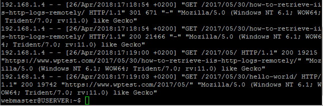
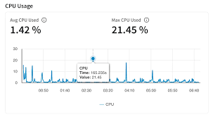
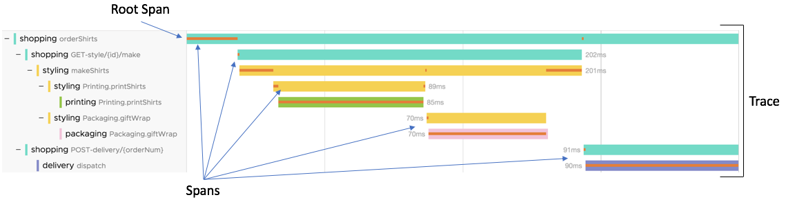
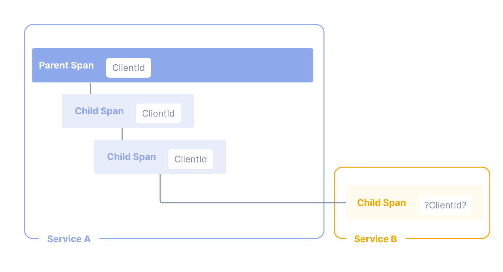
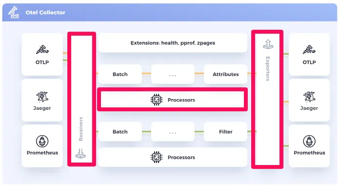

# OpenTelemetry란?

- OpenTelemetry는 분산 시스템에서의 Telemetry data를 수집하고, 분석하고, 시각화하는 데 사용되는 오픈 소스 프로젝트임

# Telemetry data란?

- Telemetry data는 분산 시스템이나 원격 장치에서 수집된 정보를 수집하는 거라서 `원격 측정 데이터`라고 함

- 주요 원격 측정 데이터는 log, metric, trace 가 있음. 이 셋을 Observability의 3가지 기둥이라고 함

## Telemetry data 주요 종류

### log

- 로그는 텍스트 파일에 기록되며, 각 로그 라인은 시간, 이벤트 유형, 이벤트 세부 정보를 포함함

- 로그의 예로 아파치 웹 서버의 로그를 들 수 있음

### metric

- 메트릭은 시간에 따른 수치 데이터임

- 예를 들어, CPU 사용률, 메모리 사용률, 네트워크 패킷 수 등이 있음

### trace

- 트레이스는 분산 시스템에서의 작업을 추적하는 데 사용됨

- 트레이스는 여러 서비스 간의 호출을 추적하고, 각 호출의 지연 시간을 측정함

- 예를 들어, 사용자가 웹 페이지를 요청하면, 웹 서버가 데이터베이스 서버에 쿼리를 보내고, 데이터베이스 서버가 응답을 반환하는 과정을 추적할 수 있음

## Telemetry data의 특징

- 대부분의 Telemetry data는 시계열 데이터이며, 각 데이터에는 타임스탬프가 포함됨

- Telemetry data에는 메타데이터가 포함될 수 있음

# OpenTelmetry의 목표

- OpenTelemetry의 목표는 벤더에 중립적인 표준을 제공하고, 다양한 프로그래밍 언어와 백엔드를 지원하는 것임

# OpenTelmetry 등장배경

- OpenTracing은 분산 시스템에서의 트레이스를 표준화하기 위해 CNCF가 채택한 프로젝트였고, OpenCensus는 분산 시스템에서의 로그, 메트릭, 트레이스를 표준화하기 위해 Google이 시작한 프로젝트였음

- 분산 시스템에서의 로그, 메트릭, 트레이스를 표준화하기 위해 OpenTracing과 OpenCensus를 합쳐 OpenTelemetry 프로젝트가 시작됨

- 2019년 5월, OpenTracing과 OpenCensus 프로젝트가 합쳐져 OpenTelemetry 프로젝트가 시작됨

- MSA, Kubernetes, Istio 등의 환경에서 분산 시스템을 모니터링하고, 디버깅하기 위해 OpenTelemetry가 필요해짐

# OpenTelmetry 특징

- OpenTelemetry는 OpenTracing과 OpenCensus의 장점을 결합하고, 더 많은 기능을 제공하면서 사실상 업계 표준이 되었음

- OpenTelemetry는 로그, 메트릭, 트레이스를 수집하고, 이를 다양한 백엔드에 전송할 수 있음

- OpenTelemetry는 여러 프로그래밍 언어를 지원함

- OpenTelemetry는 Splunk, Elastic, New Relic, Dynatrace, Jaeger, Zipkin 등 다양한 백엔드를 지원함

# OpenTelmetry 관련 주요 개념

## 신호(Signals)

- OpenTelemetry에서 사용되는 데이터의 종류를 의미함

- 로그, 메트릭, 트레이스, 배기지 등이 있음

- 로그, 메트릭, 트레이스에 대한 설명은 Telemetry data 주요 종류를 참고함

- 로그 

- 메트릭
 

- 트레이스와 스팬(Span)

### 배기지

- 일반적인 원격 측정 데이터(Telemetry data)와 별개로 OpenTelemetry에서 정의한 개념임 
- 컨텍스트 전파를 위해 사용되는 키-값 쌍으로, 분산 시스템에서의 원하는 데이터를 전파할 수 있게 함
- 서비스와 프로세스 간에 데이터를 전파하는 데 사용할 수 있음
- 다른 서비스의 트레이스, 메트릭, 로그에 추가 정보를 첨부할 수 있음
- 예를 들어, 사용자 ID, 세션 ID, 트랜잭션 ID 등을 전파할 수 있음

## OpenTelmetry 컨텍스트 전파(Context propagation)

- 신호(Signals: trace, log, metric, baggage)를 서로 연관시켜서 request의 생성 위치와 관계 없이 상관 관계를 만들 수 있게 함
- 특히 분산 시스템에서의 트레이스 추적에서 중요하며, 프로세스와 네트워크 경계를 넘어서 시스템 연관 관계를 만들 수 있게 함

### 컨텍스트(Context)

- 컨텍스트는 분산 시스템에서 일관된 모니터링과 추적을 가능하게 해서 시스템의 동작을 이해하고 문제를 효과적으로 진단할 수 있게 함
- 서비스 간 신호를 상호 연관시키는 데 필요한 정보를 포함하는 객체임
- 예: 서비스 A가 서비스 B를 호출할 때, A의 스팬 ID가 B의 다음 스팬의 부모 스팬으로 사용됨

### 전파(Propagation)

- 컨텍스트를 서비스와 프로세스 간에 이동시키는 메커니즘임
- 예: HTTP 헤더, gRPC 메타데이터, Kafka 메시지 등을 사용하여 컨텍스트를 전파할 수 있음
- 주로 계측(Instrumentation) 라이브러리에서 사용됨

## OpenTelmetry 계측(Instrumentation)

- 시스템을 관찰가능(Observability)하게 만들기 위해 시스템을 구성하는 요소들의 코드가 트레이스, 로그, 메트릭을 생성하도록 하는 것임

- OpenTelemetry는 자동 계측과 수동 계측 두 가지 방법을 제공함

### 자동 계측(Automatic Instrumentation)

- 프레임워크나 라이브러리를 사용하여 자동으로 로그, 메트릭, 트레이스를 수집하는 것임

- 예: 웹 프레임워크, 데이터베이스 라이브러리, 메시징 라이브러리 등을 사용하여 자동으로 로그, 메트릭, 트레이스를 수집할 수 있음

### 수동 계측(Manual Instrumentation)

- 코드를 직접 작성하여 로그, 메트릭, 트레이스를 수집하는 것임

- 예: 코드의 특정 부분에 로그, 메트릭, 트레이스를 추가하여 수동으로 로그, 메트릭, 트레이스를 수집할 수 있음

## OpenTelmetry 주요 구성요소(Components)

- OpenTelemetry는 여러 가지 주요 구성요소로 구성됨

### Collector

- 원격 측정 데이터(Telemetry data)를 수집하고, 이를 다양한 백엔드에 전송하는 데 사용함

- Receiver, Processor, Exporter로 구성됨
  - Receiver: gRPC 또는 HTTP 프로토콜을 통해서 원격 측정 데이터(Telemetry data)를 수신함
  - Processor: 수신한 데이터를 OpenTelemetry 백엔드로 보내기 전에 데이터를 가공함
  - Exporter: 가공된 데이터를 다양한 백엔드로 전송함

### 개발언어별 API와 SDK

- 선호하는 개발언어로 원격 측정 데이터(Telemetry data)를 생성하고 내보내기가 가능함

- 계측(Instrumentation) 라이브러리, Exporter, Zero-Code Instrumentation, Resource Detectors, Cross Service Propagation 등을 제공함

### Kubernetes operator

- Kubernetes 환경에서 OpenTelemetry Collector 및 워크로드 자동 계측을 관리하는 데 사용됨

## OpenTelmetry 시멘틱 표기법(Semantic Conventions)

- OpenTelemetry는 다양한 종류의 작업과 데이터에 대한 표준화된 표기법을 제공함
- 시멘틱 표기법에 따라 다양한 환경과 기술 스택에서 일관된 데이터 수집이 가능하게 함
- 트레이스, 로그, 메트릭, 리소스에 대한 시멘틱 표기법이 있음

## OpenTelmetry 리소스(Resources) 정보

- 원격 측정 데이터(Telemetry data)를 생성하는 엔티티(예: 서비스, 호스트, 컨테이너)를 표현하는 데 사용됨
- 엔티티의 이름, 버전, 환경, 태그 등의 정보를 포함함
- 예: Kubernetes 컨테이너에서 실행 중인 프로세스의 경우, 프로세스 이름, 파드 이름, 네임스페이스, 배포 이름 등이 리소스 속성이 될 수 있음

## OpenTelmetry 계측 범위(Instrumentation scope)

- 계측 범위는 시스템의 각 구성 요소를 명확하게 구분하고 추적할 수 있게 함
- 라이브러리, 모듈, 서비스에 고유한 이름과 버전을 부여하여 계측 범위를 구분함
- 계측 범위에 따라 로그, 메트릭, 트레이스를 생성하고 내보내기가 가능함
- 예: 서비스 A, 서비스 B, 서비스 C 등의 서비스를 구분하여 각 서비스의 로그, 메트릭, 트레이스를 생성하고 내보내기가 가능함

## OpenTelmetry 샘플링(Sampling)

- 샘플링은 비용은 줄이면서 시스템 전체의 모니터링 가시성은 유지하는 효과적인 방법임
- 대규모 분산 시스템에서 모든 요청을 추적하는 건 비용이 많이 들기 때문에 샘플링을 사용함
- 샘플링은 Head sampling, Tail sampling 등의 방법이 있음

## OpenTelmetry 용어(Glossary)

### OpenTelemetry 특화 용어

- Attribute: 원격 측정 데이터(Telemetry data)에 추가되는 키-값 쌍임
- Baggage: 분산 시스템에서의 트레이스를 전파하는 데 사용되는 메타데이터 전파 방식임
- Collector: 원격 측정 데이터(Telemetry data)를 수집하고, 이를 다양한 백엔드에 전송하는 데 사용되는 서비스임
- Context propagation: 모든 데이터 소스가 기본 컨텍스트 매커니즘을 공유할 수 있게 하는 개념임

### 데이터 관련 용어

- Signal: 로그, 메트릭, 트레이스 등의 데이터 분류를 의미함
- Span: 분산 시스템에서의 트레이스를 추적하는 데 사용되는 개념임. 트레이스 안에 있는 단일 작업을 의미함

### 구성요소 관련 용어

- Exporter: 수집된 데이터를 다양한 백엔드에 전송하는 데 사용되는 라이브러리임
- Instrumentation: 애플리케이션에 로그, 메트릭, 트레이스를 수집하는 코드를 추가하는 데 사용되는 라이브러리임
- SDK: OpenTelemetry API의 구현체로, 실제 원격 측정 데이터를 수집하는 데 사용됨

### 기타 중요 개념

- Semantic Conventions: 메타데이터의 형식을 표준화하는 데 사용되는 명명 규칙과 속성임
- Sampling: 내보내는 데이터의 양을 제어하는 매커니즘임
